# implementing_OpenTelemetry_in_Go

## Tutorial

1. Installing SigNoz

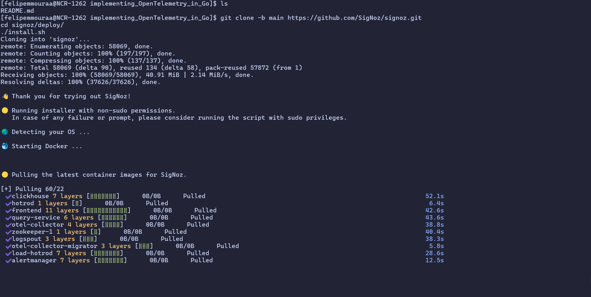

2. Acessing the UI

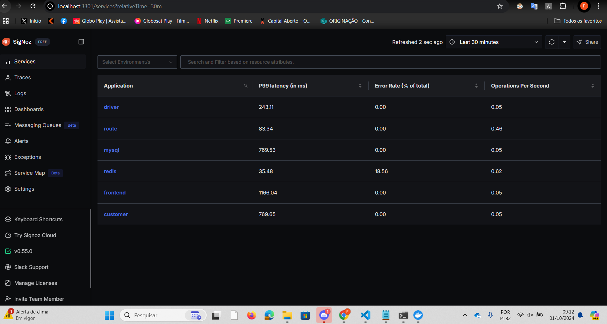

3. Getting a sample GO App from Github

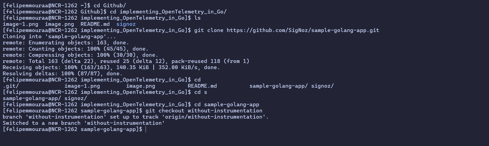

4. Installing dependencies

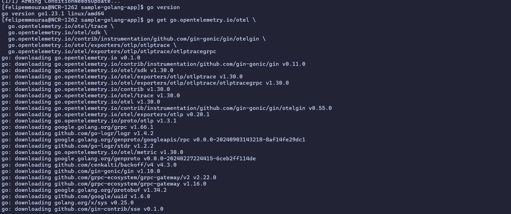

5. Declare environment variables for configuring OpenTelemetry

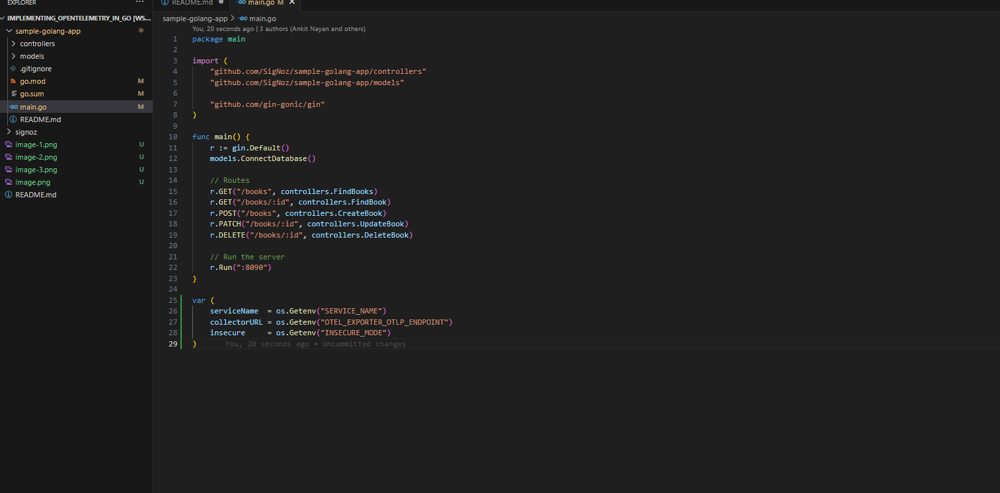

6. Instrument your Go application with OpenTelemetry

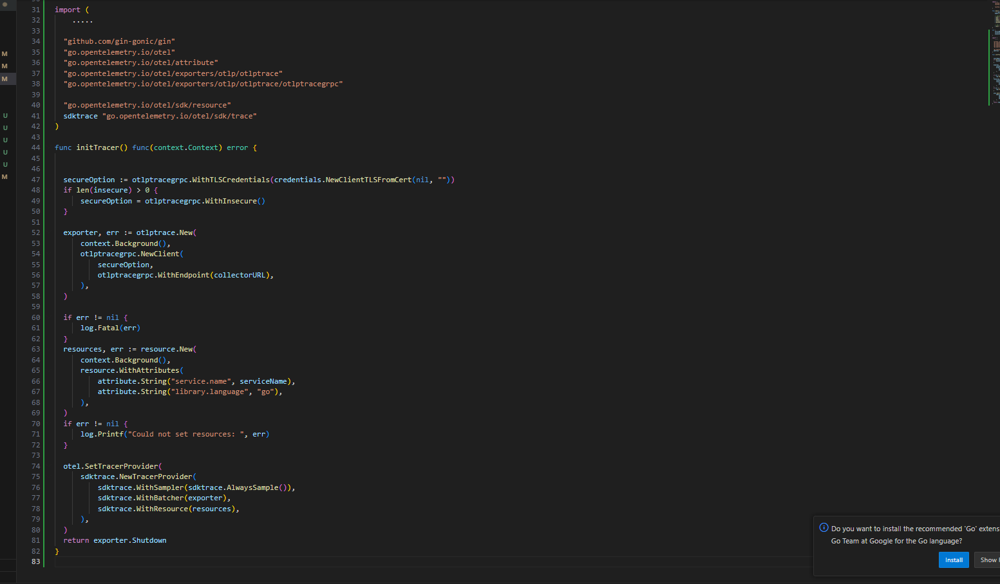

7. Initialize the tracer in main.go

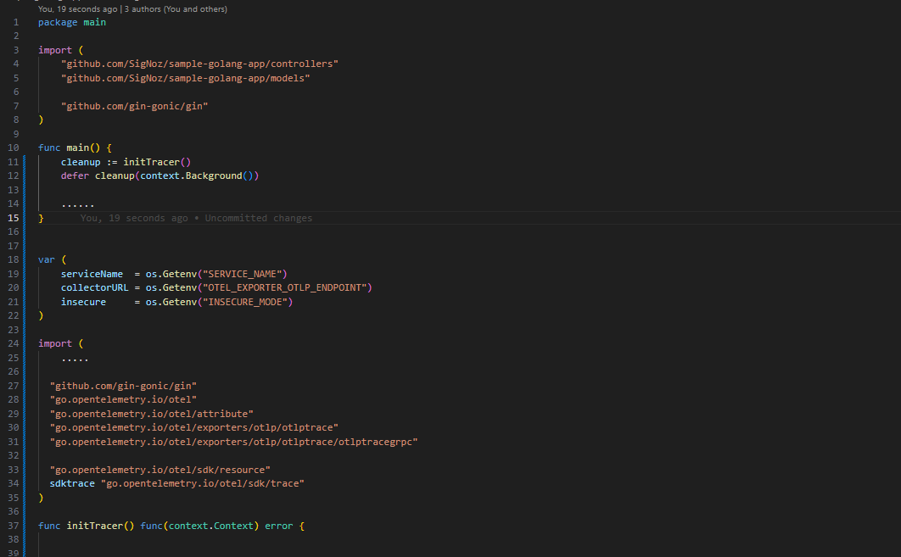

8. Add the OpenTelemetry Gin middleware

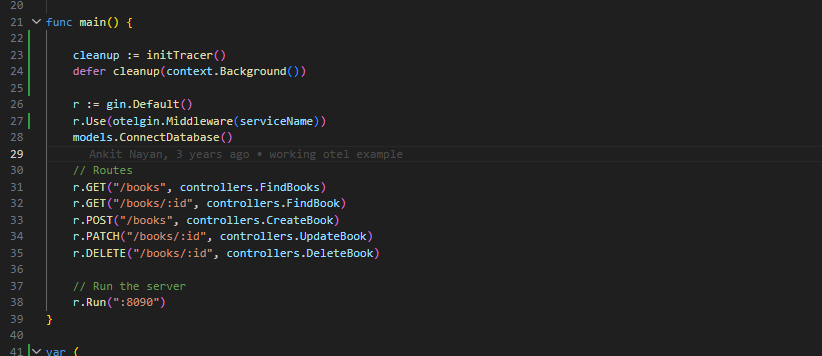

9. Set environment variables and run your Go Gin application

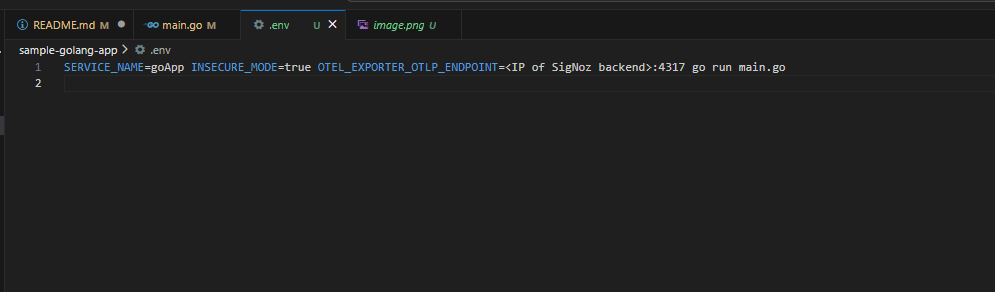

10. Run Go Gin Application

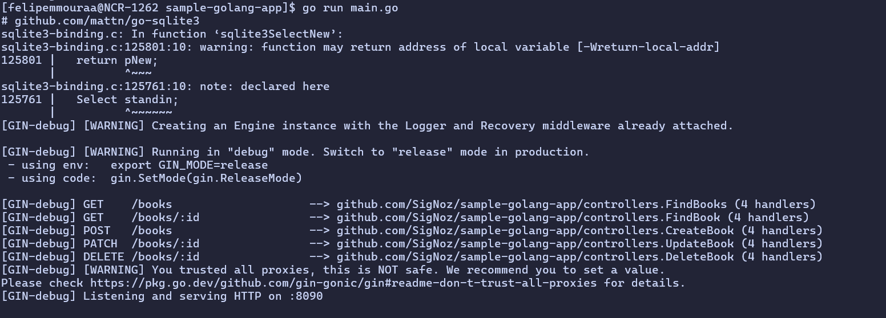

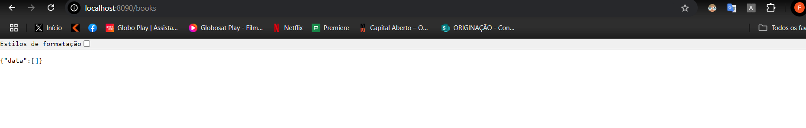

## Considerações

1. Conhecimentos Adquiridos
Ao desenvolver essa aplicação, adquiriu-se conhecimentos práticos sobre a integração de monitoramento e observabilidade em aplicações Go usando o OpenTelemetry e a plataforma SigNoz. Além disso, foi necessário entender o funcionamento de middleware no Gin, bibliotecas para traços distribuídos, e boas práticas de instrumentação de código para coleta de dados. Essa experiência reforça a compreensão sobre monitoramento em tempo real, telemetria e como esses conceitos são essenciais para diagnosticar e otimizar sistemas.

2. Por que Fazer Isso?
A observabilidade em sistemas é crucial para entender o comportamento da aplicação, identificar gargalos de performance, rastrear falhas e melhorar a experiência dos usuários. A integração entre o sample-golang-app e o SigNoz usando OpenTelemetry permite visualizar métricas detalhadas, traçar transações e mapear a performance de cada endpoint e serviço. Essa prática é importante para garantir a saúde da aplicação, fornecer suporte técnico mais eficaz, e tomar decisões baseadas em dados sobre melhorias na arquitetura.

3. O que Significa essa Aplicação?
O sample-golang-app é um exemplo de aplicação web em Go que implementa um simples sistema CRUD de gerenciamento de livros. O diferencial desse projeto é a adição de monitoramento com OpenTelemetry, enviando dados sobre o comportamento da aplicação para o SigNoz. O uso de SigNoz proporciona visibilidade sobre como a aplicação responde a diferentes cargas e permite analisar o desempenho e o fluxo de requisições HTTP, bem como identificar possíveis falhas.

4. Como a Aplicação Funciona
A aplicação consiste em uma API REST construída com o framework Gin, que oferece rotas para criar, listar, atualizar e deletar livros. A base de dados utilizada é o SQLite, e o aplicativo está configurado para enviar dados de telemetria ao SigNoz, como logs e métricas, por meio de gRPC e OpenTelemetry.

O funcionamento da aplicação pode ser dividido em:

Instrumentação: Logo no início da função main(), o tracer do OpenTelemetry é inicializado com a função initTracer(). Esse tracer coleta dados sobre as transações, endpoints acessados e a performance da aplicação.
Middlewares de OpenTelemetry: A aplicação usa o middleware otelgin.Middleware para rastrear as requisições HTTP recebidas pelo Gin, gerando traços que são enviados para o SigNoz. Esses dados são usados para analisar o tempo de resposta de cada endpoint.
Rotas CRUD: As rotas configuradas no Gin permitem manipular um conjunto de dados de livros, realizando operações CRUD. Essas rotas também são monitoradas em tempo real, e os dados são exibidos no painel do SigNoz.
5. Conclusão
Essa aplicação representa um exemplo de como implementar observabilidade em uma aplicação Go moderna. Ao configurar o sample-golang-app para se comunicar com o SigNoz, você obteve insights valiosos sobre monitoramento de desempenho e rastreamento de transações. Essas práticas são essenciais em ambientes de produção, onde a detecção de anomalias e a resolução rápida de problemas são críticas para o sucesso e a eficiência operacional.